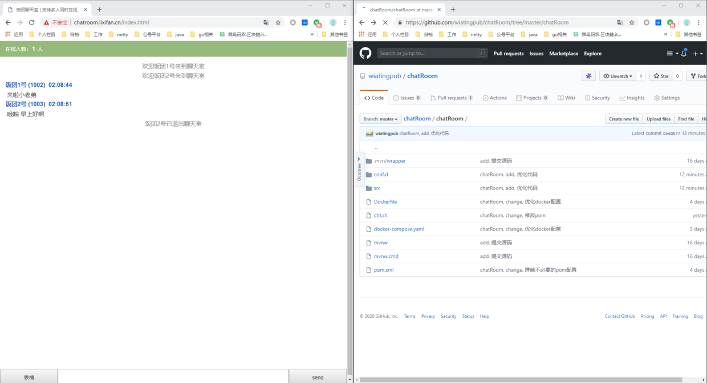

## 饭团聊天室

#### 外网部署

http://chatroom.lixifan.cn/index.html

#### 技术栈

- springboot
- netty，通讯模块使用的是netty，采用的是websocket通讯协议【聊天模块做成了组件的形式，任意项目直接导入即可使用】
- docker，为了方便部署，这里采用的是docker的部署方式
- nginx，反向代理
- html&css&js，前段随便撸的一个东西，轻喷

#### 界面表现
大概说说界面表现的东西，随便写的html页面。

登陆界面，这里开了两个端，输入昵称即可登陆，之后开始聊天

下线后的表现如下

下线后便监听到啦

#### ide如何启动

- idea导入chatRoom工程，点击File->Project Structure->点击Modules内的+导入lib下的socket组件
- 点击启动即可，监听的端口可以修改resources下的application.properties

#### 外网部署

可以关注公众号向我咨询

